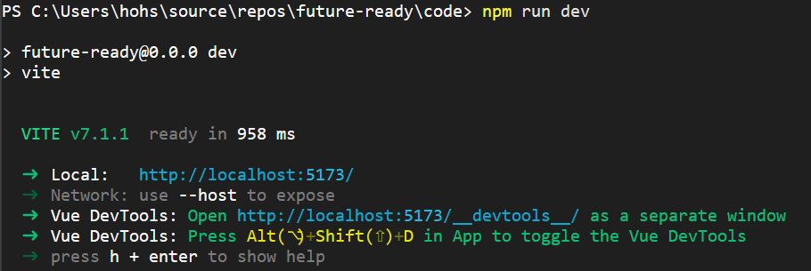

# future-ready
## Project-title: KLMMS Talent Pool System
Pitch Deck: https://drive.google.com/file/d/1Y0EdBQ3ItyajEruCEUTELZqwZPeyNL-l/view?usp=sharing

Demo Video: https://www.youtube.com/watch?v=OFI4wRRKqbw
## Team member:
1. Kelvin Chin Vui Hung
2. Sim Soo Ruan
3. Yap Jin Tin
4. Saw Khoo Mei Huey
5. Lim Jing Yi

## Problem and Solution Summary
### Personalized ATS Experience with 
- Talent Pool concept
- HR review module
- AI analysis and conclusion
- Enhanced AI keyword matching 
- Applicant management support

### AI chatbot integration in Onboarding experience
- Knowledge base briefing with AI chatbot buddy
- Onboard guideline step by step from Overview (Culture, department), Project/Product, Techstack(skill needed), Job scope based on role

## Technology Stack Used
### Frontend:
- Vue.js 3 (Single File Components, <script setup>)
- Vite (for fast development/build)
- TypeScript (see .ts files and config)
- Tailwind CSS (see tailwind.config.js and utility classes)

### Backend/Server Scripts: 
- Node.js & Supabase(PostgreSQL) for backend database

### Middleware:
- Express.js

### Database: 
- Supabase (PostgreSQL) (to store job postings, applicant profiles, and their embeddings)

### AI Model: 
- **Resume Matching algorithm:** bge-small-en-v1.5
- **Document Summarizing:** flan-t5-base
- Chatbot:
  - **Question & Answering model:** Xenova/distilbert-base-uncased-distilled-squad/DistilBERT SQuAD
  - **Retrieval-Augmented Generation(RAG):** all-MiniLM-L6-v2 
  
## Setup Instructions
1. Clone Github repos to code editor such as visual studio code
2. Ensure the device support Node Package Manager (npm)

If not, install Node.js.

Guide: https://docs.npmjs.com/downloading-and-installing-node-js-and-npm

3. Open terminal, the terminal will show path like (C:\Users\user\source\repos >)
4. Run command below
> cd future-ready
> 
> cd code
>
> npm install
> 
> npm install @supabase/supabase-js
>
> npm install concurrently
> 
> npm run dev:full
5. Ctrl + click the local link

## Reflection on Challenges and Learning
Throughout this project, we encountered several obstacles and challenges that pushed us out of our comfort zone and helped us grow. 

At the beginning of the project development, we were unfamiliar with AI APIs, and unable to make the right decision on choosing the model that balanced both performance and accuracy was not easy. 
We also struggled on understanding the flow of examining APIs, specifically under time constraints, while ensuring the integration of AI model that can work smoothly across the frontend, backend, and database in the system. 

Despite these challenges, we gained valuable insights, experience and learning. 
We learned how to build a complete project from the ground up, integrating HuggingFace models into the system through API, and setting up a project with Vue.js. 
We also became familiar with utilizing new database which is Supabase and developed a stronger understanding of the current talent acquisition landscape. 

Overall, these challenges enhanced our technical skills and gave us insights into managing real-world project development.
